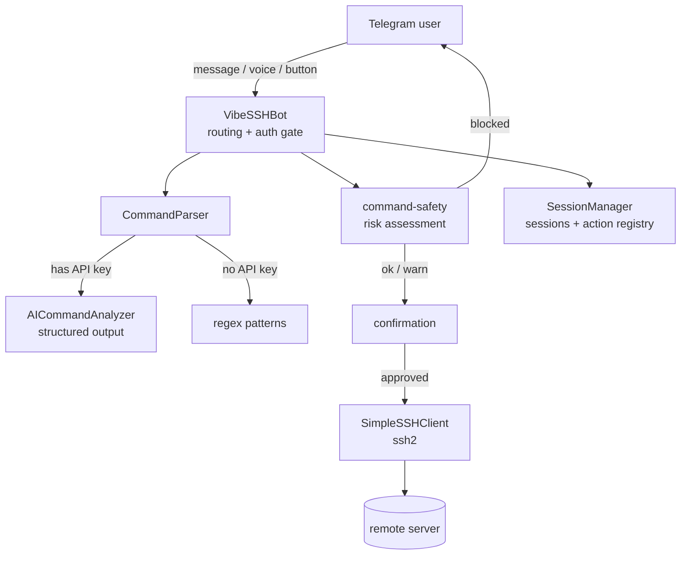

# VibeSSH

<p align="center">
  
</p>

<p align="center">
  A Telegram bot that runs shell commands on your servers over SSH — in plain language, by voice, or with raw commands, and always behind an explicit confirmation.
</p>

<p align="center">
  
  
  
</p>

---

Run your servers from your phone without opening a terminal. Type `df -h`, or just say *"how much disk is left?"* — VibeSSH turns intent into a command, shows you exactly what it will run, and executes only after you tap **confirm**. Send a voice message and it transcribes it first. It's a small, self-hosted project built to be genuinely safe to point at a real box.

## Features

- **Natural-language commands** — "show me the nginx error logs" becomes a concrete command via an LLM, with a regex fallback when no API key is set.
- **Voice control** — send a voice message; it's transcribed with Whisper, then handled like any other request.
- **Confirm-before-run** — every command is previewed with its target server and only runs after you approve it.
- **Command safety tiers** — catastrophic commands (`rm -rf /`, `mkfs`, fork bombs) are refused outright; destructive ones (`shutdown`, `kill`, `git push --force`) get a loud warning.
- **Access control** — the bot refuses to start without an allowlist and ignores everyone not on it.
- **Multiple servers** — add servers through a guided chat flow (password or private key), switch between them, run streaming commands (`tail -f`, `top`) with a live-updating message.

## Architecture



The code is a small set of single-responsibility modules:

| Module | Responsibility |
| --- | --- |
| `bot.ts` | Telegram event routing, authorization, command/confirmation flow |
| `session-manager.ts` | Per-user session state and the short-id registry backing inline buttons |
| `command-parser.ts` | Turns a message into a command (AI first, regex fallback) |
| `ai-command-analyzer.ts` | OpenAI structured-output call constrained by a Zod schema |
| `command-safety.ts` | Classifies command risk (`safe` / `caution` / `destructive` / `blocked`) |
| `ssh-client.ts` | SSH connections with host-key pinning, timeouts, output caps |
| `ui-helpers.ts` | Telegram message formatting, escaping, chunking |
| `config.ts` | Environment + persisted server config |

## Quick start

Requires Node.js ≥ 20.

```bash
git clone https://github.com/nikitacometa/vibe-ssh-telegram-bot.git
cd vibe-ssh-telegram-bot
npm install
cp .env.example .env   # then fill it in (see below)
npm run dev
```

Or with Docker:

```bash
cp .env.example .env   # fill it in first
docker compose up --build
```

### Getting a bot token

Message [@BotFather](https://t.me/BotFather), send `/newbot`, and copy the token into `TELEGRAM_BOT_TOKEN`.

### Finding your user ID

Message [@userinfobot](https://t.me/userinfobot); it replies with your numeric ID. Put it in `ALLOWED_TELEGRAM_USER_IDS`. The bot **will not start** without this — it executes shell commands, so it never runs open to the public.

## Configuration

All configuration is via environment variables (see [`.env.example`](./.env.example)).

| Variable | Required | Description |
| --- | --- | --- |
| `TELEGRAM_BOT_TOKEN` | yes | Bot token from @BotFather |
| `ALLOWED_TELEGRAM_USER_IDS` | yes | Comma-separated numeric user IDs allowed to use the bot |
| `SSH_HOST` | no | Default server host (servers can also be added in-chat) |
| `SSH_USERNAME` | no | Default server username |
| `SSH_PASSWORD` | no | Default server password (or use a key) |
| `SSH_PRIVATE_KEY_PATH` | no | Path to a private key instead of a password |
| `SSH_PORT` | no | Default SSH port (defaults to 22) |
| `OPENAI_API_KEY` | no | Enables natural-language + voice; without it, regex parsing is used |
| `OPENAI_MODEL` | no | Chat model for command analysis (default `gpt-4o-mini`) |
| `WHISPER_LANGUAGE` | no | Pin the voice language (ISO-639-1); empty = auto-detect |
| `LOG_LEVEL` | no | `debug` / `info` / `warn` / `error` (default `info`) |

## Security model

This bot executes arbitrary shell commands on real machines, so the safety design is the point, not an afterthought:

- **Fail-closed authorization.** No `ALLOWED_TELEGRAM_USER_IDS` → the bot exits on startup. Every message and button press is checked against the allowlist, and the bot only responds in private chats.
- **Explicit confirmation.** Nothing runs until you tap confirm on a preview that shows the exact command and target. Inline buttons carry a short opaque id (not the command), so a stale or duplicated tap can never run a different or repeated command.
- **Command risk tiers.** `command-safety.ts` refuses filesystem-destroying commands and warns on destructive ones before you confirm.
- **Host-key pinning.** The first successful connection records the server's SHA-256 host key; a later mismatch (possible MITM) refuses the connection.
- **Bounded execution.** Commands have a timeout and a captured-output cap so a runaway process can't wedge the bot.
- **Least privilege.** Credentials live in `.env` / an owner-only (`0600`) config file, and the Docker image runs as a non-root user.

Secrets are never committed — `config/servers.json` and `.env` are gitignored.

## Development

```bash
npm run dev          # run with hot reload (tsx)
npm test             # run the Vitest suite
npm run lint         # eslint
npm run format       # prettier
npm run typecheck    # tsc --noEmit
npm run build        # compile to dist/
```

CI (GitHub Actions) runs lint, format check, typecheck, tests, and build on every push and PR.

## License

MIT — see [LICENSE](./LICENSE).
